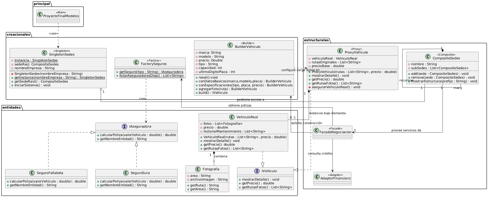

# FinalModelos
## Sistema integral para la gestión de inventario y comercialización de vehículos de segunda mano en múltiples sedes nacionales. La plataforma facilita el proceso de compra conectando clientes con asesores especializados y servicios complementarios de financiación y seguros.

## Diagrama UML

# Primer diagrama
@startuml CarMotor_DiagramaClases

' --- CONFIGURACIONES VISUALES ---
skinparam captionFontSize 14
skinparam packageStyle rectangle
skinparam shadowing false
skinparam roundcorner 5
allow_mixing

' --- PAQUETE PRINCIPAL ---
package "principal" {
    class ProyectoFinalModelos <<Main>> {
    }
}

' --- PAQUETE CREACIONALES ---
package "creacionales" {
    class SingletonSedes <<Singleton>> {
        - {static} instancia : SingletonSedes
        - sedeRaiz : CompositeSedes
        - nombreEmpresa : String
        - SingletonSedes(nombreEmpresa : String)
        + {static} getInstance(nombreEmpresa : String) : SingletonSedes
        + getSedeRaiz() : CompositeSedes
        + iniciarSistema() : void
    }

    class FactorySeguros <<Factory>> {
        + getSeguro(tipo : String) : IAseguradora
        + listarAseguradorasDisp() : List<String>
    }

    class BuilderVehiculo <<Builder>> {
        - marca : String
        - modelo : String
        - precio : Double
        - tipo : String
        - capacidad : Int
        - ultimoDigitoPlaca : Int
        + reset() : void
        + conDatosBasicos(marca, modelo, placa) : BuilderVehiculo
        + conEspecificaciones(tipo, placa, precio) : BuilderVehiculo
        + agregarFoto(ruta) : BuilderVehiculo
        + build() : IVehiculo
    }
}

' --- PAQUETE ESTRUCTURALES ---
package "estructurales" {
    class ProxyVehiculo <<Proxy>> {
        - vehiculoReal : VehiculoReal
        - rutasOriginales : List<String>
        - precioBase : double
        + ProxyVehiculo(rutas : List<String>, precio : double)
        + mostrarDetalle() : void
        + getPrecio() : double
        + getRutasFotos() : List<String>
        + asegurarVehiculoReal() : void
    }

    class CompositeSedes <<Composite>> {
        - nombre : String
        - subSedes : List<CompositeSedes>
        + add(sede : CompositeSedes) : void
        + remove(sede : CompositeSedes) : void
        + mostrarEstructura(prefijo : String) : void
    }

    class FacadeNegociacion <<Facade>> {
    }

    class AdapterFinanciero <<Adapter>> {
    }
}

' --- PAQUETE ENTIDADES ---
package "entidades" {
    interface IAseguradora {
        + calcularPoliza(valorVehiculo : double) : double
        + getNombreEntidad() : String
    }

    class SeguroFallabela {
        + calcularPoliza(valorVehiculo : double) : double
        + getNombreEntidad() : String
    }

    class SeguroSura {
        + calcularPoliza(valorVehiculo : double) : double
        + getNombreEntidad() : String
    }

    interface IVehiculo {
        + mostrarDetalle() : void
        + getPrecio() : double
        + getRutasFotos() : List<String>
    }

    class VehiculoReal {
        - fotos : List<Fotografia>
        - precio : double
        - historialMantenimiento : List<String>
        + VehiculoReal(rutas : List<String>, precio : double)
        + mostrarDetalle() : void
        + getPrecio() : double
        + getRutasFotos() : List<String>
    }

    class Fotografia {
        - area : String
        - archivoImagen : String
        + getRuta() : String
        + getArea() : String
    }
}

' --- RELACIONES ---

' Principales y Creacionales
ProyectoFinalModelos ..> SingletonSedes : <<use>>

' Estructura Composite y Singleton
SingletonSedes "1" o-- CompositeSedes

' Relaciones de Herencia e Implementación
SeguroFallabela ..|> IAseguradora
SeguroSura ..|> IAseguradora
ProxyVehiculo ..|> IVehiculo
VehiculoReal ..|> IVehiculo

' Relaciones del Proxy y Builder
ProxyVehiculo "1" *--> "0..1" VehiculoReal : instancia bajo demanda
BuilderVehiculo ..> IVehiculo : solicita construcción >
VehiculoReal "1" *--> "many" Fotografia : contiene >

' Relaciones del Facade y Adapter
FacadeNegociacion --> AdapterFinanciero : consulta crédito
FacadeNegociacion --> CompositeSedes : provee servicios de
ProxyVehiculo "1" <-- FacadeNegociacion : gestiona acceso a

' Relaciones del Factory
FactorySeguros ..> IAseguradora : crea >
VehiculoReal ..> FactorySeguros : obtiene pólizas

' Relación recursiva de Composite
CompositeSedes "1" *--> "many" CompositeSedes : subSedes \n (recursivo)

' Notas de alineación para que los paquetes queden ordenados como en tu imagen
BuilderVehiculo -[hidden]right-> ProxyVehiculo
ProxyVehiculo -[hidden]right-> CompositeSedes
IVehiculo -[hidden]right-> FacadeNegociacion

@enduml
