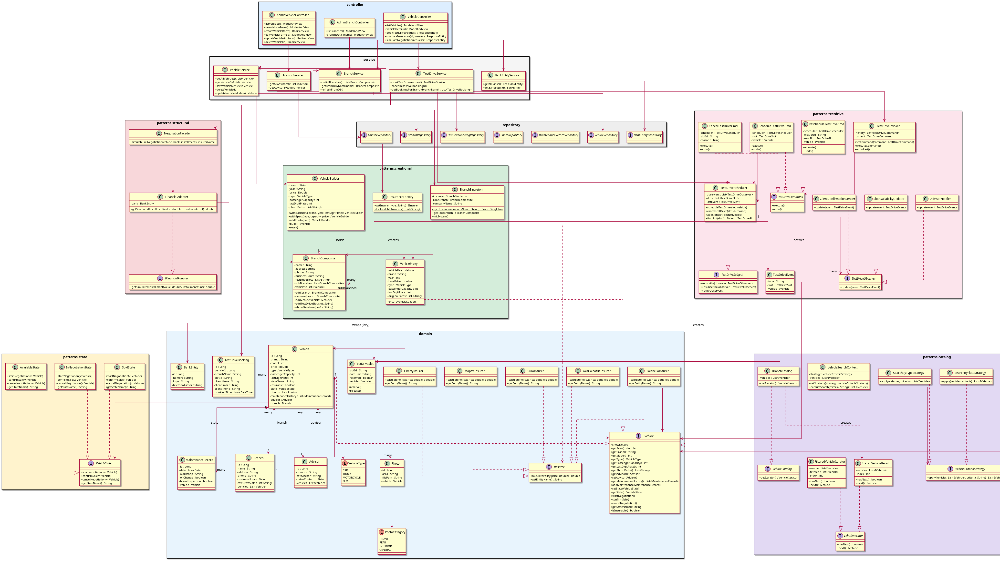

# 🚗 CarMotor - Sistema de Gestión de Concesionarios y Vehículos

[](https://spring.io/projects/spring-boot)
[](https://www.oracle.com/java/technologies/downloads/)
[-blue.svg)](https://www.h2database.com/)
[](https://maven.apache.org/)

**CarMotor** es una aplicación web robusta desarrollada en **Java 21** y **Spring Boot** para la administración integral de concesionarios de vehículos. El sistema integra operaciones comerciales como la gestión de inventario, administración de sedes físicas, reservas de pruebas de ruta (*test drives*), simulación de financiamiento bancario, cotizaciones de pólizas de seguros y flujo de negociación de precios.

Este proyecto ha sido diseñado bajo un enfoque académico/arquitectónico avanzado, implementando una gran variedad de **Patrones de Diseño de Software** (creacionales, estructurales y de comportamiento) para garantizar una arquitectura limpia, desacoplada y altamente mantenible.

---

## 🛠️ Tecnologías y Dependencias

- **Lenguaje:** Java 21
- **Framework Principal:** Spring Boot 4.0.6 (Web, Data JPA, Thymeleaf)
- **Base de Datos:** H2 Database (Persistencia local en `./data/carmotordb`)
- **Gestor de Dependencias:** Maven
- **Librería de Utilidades:** Lombok (para la reducción de código repetitivo)
- **Frontend:** HTML5, CSS3 (Vanilla CSS para estilos personalizados), Thymeleaf como motor de plantillas

---

## 📐 Patrones de Diseño Implementados

El núcleo de la aplicación está estructurado en torno a patrones de diseño clásicos de GoF (Gang of Four), organizados en las siguientes categorías dentro del paquete `com.mycompany.carmotor.model.patterns`:

### 1. Patrones Creacionales
*   **Singleton (`BranchSingleton`):** Controla el acceso a la jerarquía organizacional única de sedes del concesionario, asegurando que exista una única instancia de inicialización en memoria a partir de los datos en base de datos.
*   **Builder (`VehicleBuilder`):** Proporciona una interfaz fluida para construir paso a paso objetos de tipo `IVehicle`, abstrayendo la instanciación de vehículos con datos básicos, especificaciones técnicas y galería de fotos.
*   **Factory Method (`InsuranceFactory`):** Centraliza e instancia dinámicamente objetos de aseguradoras (`SuraInsurer`, `MapfreInsurer`, `LibertyInsurer`, `AxaColpatriaInsurer`, `FalabellaInsurer`) que implementan la interfaz `IInsurer`, basándose en el nombre de la compañía solicitado.

### 2. Patrones Estructurales
*   **Composite (`BranchComposite`):** Permite estructurar las sucursales del concesionario en forma de árbol jerárquico (sedes principales y sub-sedes), donde cada nodo composite puede contener tanto una lista de vehículos disponibles como otras sub-sedes, facilitando operaciones uniformes sobre la jerarquía.
*   **Adapter (`FinancialAdapter`):** Adapta la interfaz de simulación de cuotas de una entidad bancaria (`BankEntity`) a la interfaz requerida por el sistema (`IFinancialAdapter`), permitiendo realizar simulaciones de crédito sin acoplar directamente el dominio.
*   **Facade (`NegotiationFacade`):** Ofrece una interfaz simplificada y unificada para simular una negociación integral (cálculo de cuotas de crédito bancario, cálculo de pólizas de seguro e inspección de estado del vehículo) reduciendo la complejidad de interacción directa con múltiples subsistemas.
*   **Proxy (`VehicleProxy`):** Actúa como un intermediario o sustituto para la entidad pesada `Vehicle`, implementando carga perezosa (*lazy loading*). Carga el vehículo real desde la base de datos solo cuando se invocan métodos que requieren información detallada del dominio.

### 3. Patrones de Comportamiento
*   **State (`VehicleState`):** Gestiona el ciclo de vida y los estados de un vehículo en el concesionario. Las transiciones de comportamiento se delegan en clases concretas correspondientes a cada estado:
    *   `AvailableState` (Disponible para la venta o prueba)
    *   `InNegotiationState` (Bajo proceso de oferta de precio)
    *   `SoldState` (Vendido, bloqueando acciones comerciales)
*   **Iterator (`VehicleIterator`):** Define un mecanismo uniforme para recorrer colecciones de vehículos. Se implementan de forma personalizada:
    *   `BranchVehicleIterator` (recorrido secuencial estándar por sede)
    *   `FilteredVehicleIterator` (recorrido condicional sobre un subconjunto filtrado)
*   **Strategy (Búsqueda y Ordenamiento):** Permite cambiar dinámicamente el criterio de búsqueda en el catálogo. `VehicleSearchContext` utiliza estrategias concretas que implementan `VehicleCriteriaStrategy`:
    *   `SearchByBrandStrategy` (Filtro por marca)
    *   `SearchByTypeStrategy` (Filtro por tipo de vehículo: Carro, Moto, SUV, etc.)
    *   `SearchByPlateStrategy` (Filtro por último dígito de placa)
    *   `SortByPriceStrategy` (Ordenamiento por precio de menor a mayor)
*   **Template Method (`InsuranceCalculator`):** Define el esqueleto del algoritmo de cálculo para cotizar una póliza de seguro (`calculatePolicy()`). Las aseguradoras concretas heredan de esta clase y sobrescriben los métodos gancho/abstractos (`assessRisk()`, `applyDiscount()`, `getBaseRate()`) para inyectar sus propias reglas de negocio y factores de riesgo.
*   **Command (`TestDriveCommand`):** Encapsula las solicitudes de reservas de pruebas de conducción (`ScheduleTestDriveCmd`, `CancelTestDriveCmd`, `RescheduleTestDriveCmd`) permitiendo parametrizar las acciones del usuario, mantener un historial de operaciones y habilitar la funcionalidad de deshacer (*undo*).
*   **Observer (`TestDriveObserver`):** Implementa un esquema de suscripción donde `TestDriveScheduler` (que actúa como `TestDriveSubject`) notifica eventos a múltiples observadores registrados cuando ocurre un cambio en una prueba de conducción. Los observadores concretos incluyen:
    *   `SlotAvailabilityUpdater` (Actualiza el estado de disponibilidad del slot)
    *   `ClientConfirmationSender` (Simula el envío de una confirmación al cliente)
    *   `AdvisorNotifier` (Notifica al asesor asignado sobre el evento)

---

## 🗺️ Diagrama UML del Sistema

El siguiente diagrama de clases representa la arquitectura completa del proyecto, organizada por capas (Controladores, Servicios, Repositorios, Configuración y Dominio/Patrones):



---

## ⚡ Guía de Ejecución y Configuración

Sigue estos pasos para compilar y ejecutar el proyecto localmente:

### Prerrequisitos
- **Java Development Kit (JDK) 21** instalado y configurado en la variable de entorno `JAVA_HOME`.
- **Apache Maven** (u utilizar el wrapper de Maven `./mvnw` incluido).

### Instalación y Compilación
1. Clona este repositorio o ubícate en la carpeta raíz del proyecto.
2. Compila el código del proyecto y descarga las dependencias ejecutando:
   ```bash
   mvn clean install
   ```

### Ejecutar la Aplicación
Para iniciar el servidor embebido Tomcat (por defecto configurado en el puerto **8081**), ejecuta:
```bash
./mvnw spring-boot:run
```
Una vez que el servidor se inicie correctamente, abre tu navegador web y accede a:
- **Aplicación Principal:** [http://localhost:8081](http://localhost:8081)
- **Consola de Base de Datos H2:** [http://localhost:8081/h2-console](http://localhost:8081/h2-console)
  - **JDBC URL:** `jdbc:h2:file:./data/carmotordb`
  - **Usuario:** `sa`
  - **Contraseña:** *(dejar vacío)*

---

## 👥 Autores del Proyecto

A continuación se listan los autores principales que han contribuido al desarrollo, diseño e implementación del sistema **CarMotor**:

| Nombre | Código |
|---|---|
| Juan Daniel Palomino García | 20232020065 |
| Juan Camilo Carvajal Camargo | 20232020026 |
| Josep Emmanuel Leon Joya | 20231020160 |

---
